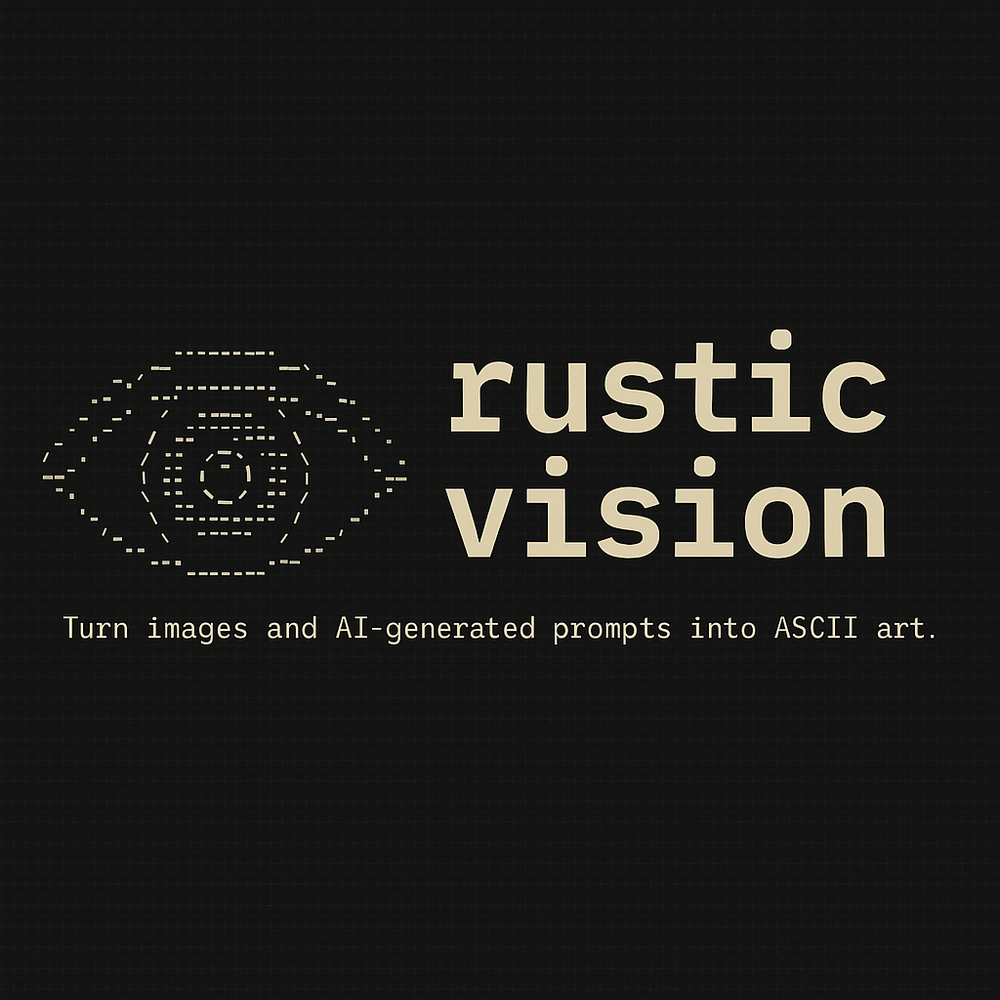

<table>
  <tr>
    <td>
      
    </td>
    <td>
      <h1>RUSTic Vision</h1>
      <p><em>Turn images into beautiful ASCII art — right in your browser or terminal.</em></p>
    </td>
  </tr>
</table>

---

## 🧠 What is it?

`RUSTic Vision` is a blazing-fast Rust application that transforms:
- **Uploaded images** into ASCII art (via web UI)
- **Local images** into ASCII art (via CLI)

This project uses a modern Rust stack:
- 🦀 [Rust](https://www.rust-lang.org/) for core logic
- ⚡ [Leptos](https://leptos.dev/) for the frontend
- 🖼️ [`image`](https://crates.io/crates/image) crate for pixel manipulation
- 📦 [Trunk](https://trunkrs.dev/) for bundling the frontend

> ⚠️ OpenAI prompt-to-image generation is planned but **not implemented yet**.

---

## ✨ Features

- Upload images and convert to ASCII instantly in the browser
- CLI tool to convert images directly from the terminal
- Adjustable resolution (columns) and aspect ratio scale
- Option to output to file or print to terminal
- Clean and modular Rust code (supports WASM and CLI targets)

---

## 📦 CLI Usage

```bash
# Build and run the CLI
cargo run --features cli -- --image-path cat.jpg

## Run Locally

# Install dependencies
cargo install trunk

# Run dev server
trunk serve --open
